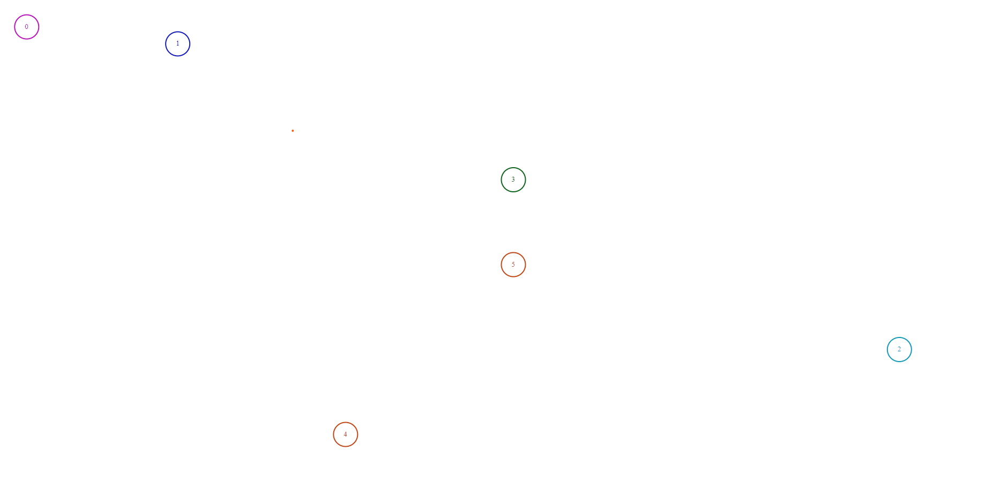

# Live coding session task

## Problem

The app should render gotten comments as circles with the following stats:

- 32 by 32 px
- transparent background
- colored 2px border (`color` may be found in the API)
- content is `id` colored with `color`
- content must be centered inside of the circle

Positioning is tricky though. Coordinates `position` from the API are not px but abstract units. Consider the screen as a canvas with dimensions 600x600. So a comment with `position` `[300, 300]` must be in the center of any dimensional screen.

## Sample result

